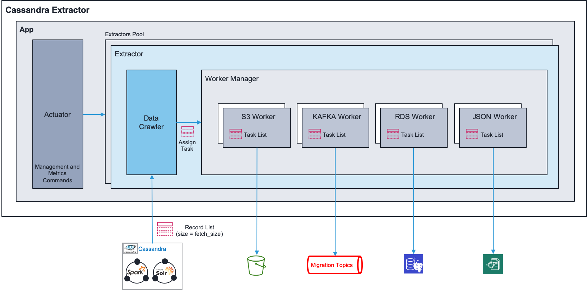
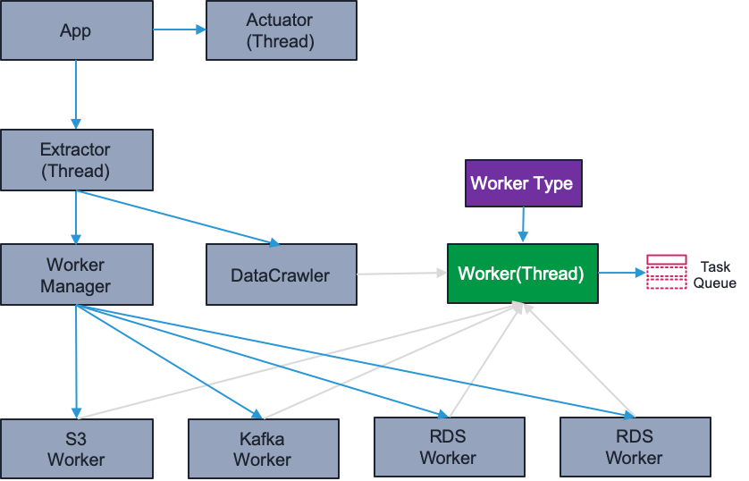

Data Extractor to Kafka, S3 or RDS
===

This package provide a service to extract data from Cassandra to a Kafka broker or an AWS S3 bucket.

See cassandra-extractor.properties to configure the Logger, Kafka broker and the S3 bucket.
All properties may be overrided by environment variables or command line arguments.
Priority is : (1) Command line arguments, (2) environment variables, (3) Properties file

Overview:
---


Class overview:
---


Usage
---
```bash
python3 usage: app.py [-h] [--config-file CONFIG_FILE]
              [--keyspace KEYSPACE]
              [--hosts HOSTS]
              [--port PORT]
              [--tables TABLES]
              [--username USERNAME]
              [--password PASSWORD]
              [--connect-timeout CONNECT_TIMEOUT]
              [--default-client-id DEFAULT_CLIENT_ID]
              [--stateless STATELESS]
              [--wsgi-port WSGI_PORT]
              [--redis-host REDIS_HOST]
              [--redis-port REDIS_PORT]
              [--redis-password REDIS_PASSWORD]
              [--redis-db REDIS_DB]
              [--enable-kafka ENABLE_KAFKA]
              [--enable-s3 ENABLE_S3]
              [--enable-rds ENABLE_RDS]
              [--enable-json ENABLE_JSON]
              [--max-worker-threads MAX_WORKER_THREADS]
              [--auto-start-workers AUTO_START_WORKERS]
              [--max-memory-usage MAX_MEMORY_USAGE]
              [--max-memory-usage-resume-threshold MAX_MEMORY_USAGE_RESUME_THRESHOLD]
              [--memory-usage-check-delay MEMORY_USAGE_CHECK_DELAY]
              [--fetch-size FETCH_SIZE]
              [--pages PAGES] [--columns COLUMNS]
              [--sort-by SORT_BY]
              [--filter FILTER]
              [--modified-timestamp-filter MODIFIED_TIMESTAMP_FILTER]
              [--paging-mode {driver,cursor}]
              [--table-specs TABLE_SPECS]
              [--table-specs-file TABLE_SPECS_FILE]
              [--table-specs-files-location TABLE_SPECS_FILES_LOCATION]
              [--timestamp-format TIMESTAMP_FORMAT]
              [--kafka-hosts KAFKA_HOSTS]
              [--kafka-security-protocol KAFKA_SECURITY_PROTOCOL]
              [--kafka-ssl-check-hostname KAFKA_SSL_CHECK_HOSTNAME]
              [--kafka-ssl-cafile KAFKA_SSL_CAFILE]
              [--kafka-ssl-certfile KAFKA_SSL_CERTFILE]
              [--kafka-ssl-keyfile KAFKA_SSL_KEYFILE]
              [--kafka-ssl-password KAFKA_SSL_PASSWORD]
              [--kafka-topics KAFKA_TOPICS]
              [--kafka-topics-prefix KAFKA_TOPICS_PREFIX]
              [--kafka-group-id KAFKA_GROUP_ID]
              [--kafka-flush-latency KAFKA_FLUSH_LATENCY]
              [--kafka-request-timeout-ms KAFKA_REQUEST_TIMEOUT_MS]
              [--kafka-auto-flush KAFKA_AUTO_FLUSH]
              [--kafka-template KAFKA_TEMPLATE]
              [--kafka-message-key KAFKA_MESSAGE_KEY]
              [--kafka-headers KAFKA_HEADERS]
              [--kafka-partitions KAFKA_PARTITIONS]
              [--s3-bucket S3_BUCKET]
              [--s3-object-key S3_OBJECT_KEY]
              [--s3-template S3_TEMPLATE]
              [--log-directory LOG_DIRECTORY]
              [--log-file-name LOG_FILE_NAME]
              [--log-level LOG_LEVEL]
              [--log-format LOG_FORMAT]
              [--log-module-name LOG_MODULE_NAME]
              [--log-enable-gelf-format LOG_ENABLE_GELF_FORMAT]
              [--log-extra-attrs LOG_EXTRA_ATTRS]
              [--rds-host RDS_HOST]
              [--rds-port RDS_PORT]
              [--rds-username RDS_USERNAME]
              [--rds-password RDS_PASSWORD]
              [--rds-schema RDS_SCHEMA]
              [--rds-table RDS_TABLE]
              [--rds-columns RDS_COLUMNS]
              [--rds-template RDS_TEMPLATE]
              [--rds-use-transaction RDS_USE_TRANSACTION]
              [--rds-partition-column RDS_PARTITION_COLUMN]
              [--json-filename JSON_FILENAME]
              [--json-mode JSON_MODE]
              [--json-header JSON_HEADER]
              [--json-footer JSON_FOOTER]
              [--json-template JSON_TEMPLATE]

optional arguments:
  -h, --help            show this help message and exit
  --config-file CONFIG_FILE, -c CONFIG_FILE
                        Config filename, Env. : CONFIG_FILE
  --keyspace KEYSPACE, -k KEYSPACE
                        Cassandra keyspace, Env. : CASSANDRA_KEYSPACE
  --hosts HOSTS, -H HOSTS
                        Cassandra host, Env. : CASSANDRA_HOSTS
  --port PORT, -P PORT  Cassandra port, Env. : CASSANDRA_PORT
  --tables TABLES, -T TABLES
                        Cassandra tables to extract, Env. : CASSANDRA_TABLES
  --username USERNAME, -u USERNAME
                        Cassandra username, Env. : CASSANDRA_USERNAME
  --password PASSWORD, -p PASSWORD
                        Cassandra password, Env. : CASSANDRA_PASSWORD
  --connect-timeout CONNECT_TIMEOUT, -t CONNECT_TIMEOUT
                        Cassandra connect timeout, Env. :
                        CASSANDRA_CONNECT_TIMEOUT
  --default-client-id DEFAULT_CLIENT_ID
                        Default client id, Env. : DEFAULT_CLIENT_ID
  --stateless STATELESS
                        Stateless data crawling, Env. : STATELESS_CRAWLER
  --wsgi-port WSGI_PORT
                        The WSGI listen port, Env. : WSGI_PORT
  --redis-host REDIS_HOST
                        REDIS host, Env. : REDIS_HOST
  --redis-port REDIS_PORT
                        REDIS port, Env. : REDIS_PORT
  --redis-password REDIS_PASSWORD
                        REDIS password, Env. : REDIS_PASSWORD
  --redis-db REDIS_DB   REDIS db, Env. : REDIS_DB
  --enable-kafka ENABLE_KAFKA
                        Enable KAFKA, Env. : ENABLE_KAFKA
  --enable-s3 ENABLE_S3
                        Enabled S3, Env. : ENABLE_S3
  --enable-rds ENABLE_RDS
                        Enabled RDS PostgreSQL, Env. : ENABLE_RDS
  --enable-json ENABLE_JSON
                        Enabled JSON output, Env. : ENABLE_JSON
  --max-worker-threads MAX_WORKER_THREADS, -w MAX_WORKER_THREADS
                        Max worker threads, Env. : MAX_WORKER_THREADS
  --auto-start-workers AUTO_START_WORKERS
                        Auto start workers, Env. : AUTO_START_WORKERS
  --max-memory-usage MAX_MEMORY_USAGE
                        Max memory usage (Mb), Env. : MAX_MEMORY_USAGE
  --max-memory-usage-resume-threshold MAX_MEMORY_USAGE_RESUME_THRESHOLD
                        Max memory usage resume threshold (Mb), Env. :
                        MAX_MEMORY_USAGE_RESUME_THRESHOLD
  --memory-usage-check-delay MEMORY_USAGE_CHECK_DELAY
                        Memory usage check delay (sec), Env. :
                        MEMORY_USAGE_CHECK_DELAY
  --fetch-size FETCH_SIZE, -f FETCH_SIZE
                        Cassandra query fetch size, Env. :
                        CASSANDRA_FETCH_SIZE
  --pages PAGES         Total pages to fetch, Env. : CASSANDRA_PAGES
  --columns COLUMNS     Dataset columns, Env. : CASSANDRA_COLUMNS
  --sort-by SORT_BY     Dataset sort fields, Env. : CASSANDRA_SORT_BY
  --filter FILTER       Dataset SolR filter, Env. : CASSANDRA_FILTER
  --modified-timestamp-filter MODIFIED_TIMESTAMP_FILTER
                        Dataset Modified Timestamp filter, Env. :
                        CASSANDRA_MODIFIED_TIMESTAMP_FILTER
  --paging-mode {driver,cursor}
                        Dataset paging mode, Env. : CASSANDRA_PAGING_MODE
  --table-specs TABLE_SPECS
                        Dataset table specs, Env. : CASSANDRA_TABLE_SPECS
  --table-specs-file TABLE_SPECS_FILE
                        Dataset table specs file, Env. :
                        CASSANDRA_TABLE_SPECS_FILE
  --table-specs-files-location TABLE_SPECS_FILES_LOCATION
                        Dataset table specs files location, Env. :
                        CASSANDRA_TABLE_SPECS_FILE_LOCATION
  --timestamp-format TIMESTAMP_FORMAT
                        Dataset timestamp format, Env. :
                        CASSANDRA_TIMESTAMP_FORMAT
  --kafka-hosts KAFKA_HOSTS
                        Kafka server host, Env. : KAFKA_HOSTS
  --kafka-security-protocol KAFKA_SECURITY_PROTOCOL
                        KAFKA security protocol, Env. :
                        KAFKA_SECURITY_PROTOCOL
  --kafka-ssl-check-hostname KAFKA_SSL_CHECK_HOSTNAME
                        KAFKA ssl check hostname, Env. :
                        KAFKA_SSL_CHECK_HOSTNAME
  --kafka-ssl-cafile KAFKA_SSL_CAFILE
                        KAFKA ssl cafile, Env. : KAFKA_SSL_CAFILE
  --kafka-ssl-certfile KAFKA_SSL_CERTFILE
                        KAFKA ssl certfile, Env. : KAFKA_SSL_CERTFILE
  --kafka-ssl-keyfile KAFKA_SSL_KEYFILE
                        KAFKA ssl keyfile, Env. : KAFKA_SSL_KEYFILE
  --kafka-ssl-password KAFKA_SSL_PASSWORD
                        KAFKA ssl keyfile password, Env. : KAFKA_SSL_PASSWORD
  --kafka-topics KAFKA_TOPICS
                        Kafka topics, Env. : KAFKA_TOPICS
  --kafka-topics-prefix KAFKA_TOPICS_PREFIX
                        Kafka topics prefix, Env. : KAFKA_TOPIC_PREFIX
  --kafka-group-id KAFKA_GROUP_ID
                        Kafka client Group Id, Env. : KAFKA_GROUP_ID
  --kafka-flush-latency KAFKA_FLUSH_LATENCY
                        Kafka flush latency (ms), Env. : KAFKA_FLUSH_LATENCY
  --kafka-request-timeout-ms KAFKA_REQUEST_TIMEOUT_MS
                        Kafka request timeout (ms), Env. :
                        KAFKA_REQUEST_TIMEOUT_MS
  --kafka-auto-flush KAFKA_AUTO_FLUSH
                        Kafka auto flush, Env. : KAFKA_AUTO_FLUSH
  --kafka-template KAFKA_TEMPLATE
                        KAFKA message template, Env. : KAFKA_TEMPLATE
  --kafka-message-key KAFKA_MESSAGE_KEY
                        KAFKA message key, Env. : KAFKA_MESSAGE_KEY
  --kafka-headers KAFKA_HEADERS
                        KAFKA message headers, Env. : KAFKA_HEADERS
  --kafka-partitions KAFKA_PARTITIONS
                        KAFKA topic partitions, Env. : KAFKA_PARTITIONS
  --kafka-acks KAFKA_ACKS
                        KAFKA send acknowlege, Env. : KAFKA_ACKS
  --kafka-max-request-size KAFKA_MAX_REQUEST_SIZE
                        Kafka max request size (bytes), Env. :
                        KAFKA_MAX_REQUEST_SIZE
  --s3-bucket S3_BUCKET
                        S3 Bucket name, Env. : S3_BUCKET
  --s3-object-key S3_OBJECT_KEY
                        S3 Object Key, Env. : S3_OBJECT_KEY
  --s3-template S3_TEMPLATE
                        S3 Object content template, Env. : S3_TEMPLATE
  --log-directory LOG_DIRECTORY
                        Log output directory, Env. : LOG_DIRECTORY
  --log-file-name LOG_FILE_NAME
                        Log output file name, Env. : LOG_FILE_NAME
  --log-level LOG_LEVEL
                        Log level, Env. : LOG_LEVEL
  --log-format LOG_FORMAT
                        Log format, Env. : LOG_FORMAT
  --log-module-name LOG_MODULE_NAME
                        Log module name, Env. : LOG_MODULE_NAME
  --log-enable-gelf-format LOG_ENABLE_GELF_FORMAT
                        Log enable GELF format, Env. : LOG_ENABLE_GELF_FORMAT
  --log-extra-attrs LOG_EXTRA_ATTRS
                        Log extra attributes for GELF formatter, Env. :
                        LOG_EXTRA_ATTRS
  --rds-host RDS_HOST   RDS PostgreSQL host, Env. : RDS_HOST
  --rds-port RDS_PORT   RDS PostgreSQL port, Env. : RDS_PORT
  --rds-username RDS_USERNAME
                        RDS PostgreSQL username, Env. : RDS_USERNAME
  --rds-password RDS_PASSWORD
                        RDS PostgreSQL password, Env. : RDS_PASSWORD
  --rds-schema RDS_SCHEMA
                        RDS PostgreSQL schema, Env. : RDS_SCHEMA
  --rds-table RDS_TABLE
                        RDS PostgreSQL table, Env. : RDS_TABLE
  --rds-columns RDS_COLUMNS
                        RDS columns names, Env. : RDS_COLUMNS
  --rds-template RDS_TEMPLATE
                        RDS SQL template, Env. : RDS_TEMPLATE
  --rds-use-transaction RDS_USE_TRANSACTION
                        RDS Transaction mode, Env. : RDS_USE_TRANSACTION
  --rds-partition-column RDS_PARTITION_COLUMN
                        RDS Table partition column, Env. :
                        RDS_PARTITION_COLUMN
  --json-filename JSON_FILENAME
                        JSON Filename, Env. : JSON_FILENAME
  --json-mode JSON_MODE
                        JSON write mode, Env. : JSON_MODE
  --json-header JSON_HEADER
                        JSON File header, Env. : JSON_HEADER
  --json-footer JSON_FOOTER
                        JSON File footer, Env. : JSON_FOOTER
  --json-template JSON_TEMPLATE
                        JSON template, Env. : JSON_TEMPLATE
```

Run
===

Cassandra to Kafka topic

```bash
python3 wad-labs/hub/migration/app.py -k keyspace -H localhost -u cassandra -p cassandra --table client --s3-bucket "bucket-name" --s3-object-key "path/client-%s.json" --fetch-size 10
```

Cassandra to S3
```bash
python3 wad-labs/hub/migration/app.py -k keyspace -H localhost -u cassandra -p cassandra --table client --kafka-topic clients --fetch-size 10
```

Cassandra (with SolR filter) to S3
```bash
python3 wad-labs/hub/migration/app.py -k keyspace -H localhost -u cassandra -p cassandra --table client --filter *:* --kafka-topic clients --fetch-size 10
```

Docker & Kubernetes deployment
===
The docker image is available on Nexus in [Docker](http://artifacts.wad-labs.fr/nexus/#browse/browse:Docker:v2%2Fcassandra-extractor) repository
Pull a specific tag:
```bash
docker pull cassandra-extractor:2.3.4
```

Usage:
```
docker run \
-p 8000:8000 \
-v <Home>/app.properties:/etc/wad-labs/app.properties \
-v <Home>/logs:/opt/cassandra-migration/logs \
cassandra-migration
```

Kubernetes definition:
```
spec:
	containers:
	- name: cassandra-extractor
		image: cassandra-extractor:2.3.4
```

Monitoring & Management service
===

cassandra-extractor has a service for manging the workers, monitoring and collect metrics.
The service is a REST API, it exposes the following resources :

Metrics
---
```
GET /metrics
```

Return a set of metrics in Prometheus format

`Global metrics:`

* ACTIVITY_TIME = Summary('program_activity_time', 'Program activity time')
* PROGRAM_INFO = Info('program_info', 'Program Info')
* CASSANDRA_FETCH_LATENCY = Histogram('cassandra_fetch_latency', 'Cassandra page fetch latency')

`Workers metrics:`

* PROCESSED_TASKS = Counter('processed_tasks', 'Processed tasks')
* PROCESSED_RECORDS = Counter('processed_records', 'Processed records')
* TASK_PROCESSING_LATENCY = Histogram('task_processing_latency')
* WRITE_LATENCY =  Histogram('write_latency', 'Write latency')

`Example:`

```
curl -X GET localhost:8000/metrics

# HELP program_activity_time Program activity time
# TYPE program_activity_time summary
program_activity_time_count 16.0
program_activity_time_sum 16.0
# TYPE program_activity_time_created gauge
program_activity_time_created 1.576759555432539e+09
# HELP program_info_info Program Info
# TYPE program_info_info gauge
program_info_info{name="Cassandra Migration",version="2.3.4"} 1.0
# HELP assigned_tasks_total Assigned tasks counter
# TYPE assigned_tasks_total counter
assigned_tasks_total 0.0
# TYPE assigned_tasks_created gauge
assigned_tasks_created 1.576759555459857e+09
# HELP fetch_latency Data fetch latency (per fetch_size)
# TYPE fetch_latency histogram
# HELP total_records Total records to process
# TYPE total_records gauge
total_records{instance="datacrawler_event_7f7fbada"} 0.0
# HELP processed_records_total Processed records
# TYPE processed_records_total counter
processed_records_total{instance="datacrawler_event_7f7fbada"} 0.0
# TYPE processed_records_created gauge
processed_records_created{instance="datacrawler_event_7f7fbada"} 1.5767595554656e+09
# HELP ignored_records_total Ignored records
# TYPE ignored_records_total counter
# HELP processed_tasks_total Processed tasks
# TYPE processed_tasks_total counter
processed_tasks_total{instance="datacrawler_event_7f7fbada"} 0.0
# TYPE processed_tasks_created gauge
processed_tasks_created{instance="datacrawler_event_7f7fbada"} 1.5767595554655428e+09
# HELP task_processing_latency Processing latency
# TYPE task_processing_latency histogram
# HELP write_latency Write latency
# TYPE write_latency histogram
# HELP idle_time Idle time
# TYPE idle_time gauge
# HELP start_time Worker start time
# TYPE start_time gauge
start_time{instance="datacrawler_event_7f7fbada"} 1.576755955461394e+012
# HELP end_time Worker end time
# TYPE end_time gauge
```

```
GET /stats
```
Returns a JSON object containing stats about the extractor and active workers

`Example:`

```
curl -X GET localhost:8000/stats

{
    "general": {
        "info": {
            "name": "Cassandra Migration",
            "version": "2.3.4"
        },
        "start_time": "1576753771.429803",
        "activity_time": 4227.0,
        "memory_usage": 89.358336
    },
    "extractors": [
        {
            "id": "081e5e0e-2250-11ea-adeb-76c7eccdc391",
            "table": "event",
            "assigned_tasks": 0.0,
            "workers": [
                {
                    "id": "081e666a-2250-11ea-adeb-76c7eccdc391",
                    "type": "datacrawler",
                    "status": "Idle",
                    "processed_records": 0.0,
                    "ignored_records": 0.0,
                    "total_records": 0.0,
                    "fetch_latency": 0.0,
                    "tasks": 0.0,
                    "start_time": 1576753771716.329,
                    "end_time": 0.0,
                    "idle_time": 0.0,
                    "last_error": null,
                    "progress": 0
                }
            ]
        }
    ]
}
```

```
GET /config
```
Returns a JSON object containing the active configuration

`Example:`

```
curl -X GET localhost:8000/config
{
    "extractors": [
        {
            "id": "6969b2ba-2237-11ea-85d4-784f437eae3f",
            "table": "event",
            "config": {
                ...
            }
        }
    ]
}
```

```
POST /set-config
```
Reloads configuration changes from Environemnt Variables or properties files, and notify all active workers.
Workers waits to finish the active task befor reloading their configuration

`Example:`

```
curl -X GET localhost:8000/config

{
	"instance": [
		{
			"table": "event",
			"config": [
				"[DEFAULT]",
				"enable_kafka=no",
				"enable_s3=no",
				"enable_json=yes",
				"max_worker_threads=16",
				"cassandra_table=event",
				"cassandra_fetch_size=1000",
				"kafka_topics=EventBean"
			]
		}
	]
}
```
*instance* is a list off extractor instance, one for each table 
*instance.table* is the table name 
*instance.config* is the extractor configuration, properties file splitted to an array off properties

```
POST /start
```
Request new extracting task and starts workers

`Example:`

```
curl -X GET localhost:8000/config

{"instance": ["event"]}
```
*instance* is a list off extractor instance, one for each table 

```
POST /abort
```
Abort all active worker tasks
equest new extracting task and starts workers

`Example:`

```
curl -X GET localhost:8000/config

{"instance": ["event"]}
```

```
POST /pause
```
Pause active crawler and workers tasks

`Example:`

```
curl -X GET localhost:8000/config

{"instance": ["event"], "crawler": true, "worker", true}
```
*crawler* if 'crawler' is set to true, datacrawler will be paused
*worker* if 'worker' is set to true, workers will be paused

```
POST /resume
```
Resume crawler and workers tasks

`Example:`

```
curl -X GET localhost:8000/config

{"instance": ["event"], "crawler": true, "worker", true}
```
*crawler* if 'crawler' is set to true, datacrawler will be resumed
*worker* if 'worker' is set to true, workers will be resumed

```
POST /create
```
Create new extractor instance

`Example:`

```
curl -X GET localhost:8000/config

{"instance": ["event"]}
```

```
POST /shutdown
```
Shutdown the extractor, waits until all workers finish their tasks

`Example:`

```
curl -X GET localhost:8000/config

{"instance": ["event"]}
```

```
POST /scaleup
```
Scale extractor worker up, increase max_worker_thread, datacrawler

`Example:`

```
curl -X GET localhost:8000/scaleup

{"instance": ["event"]}
```

```
POST /scaledown
```
Scale extractor worker down, decrease the max_worker_thread and delete the last worker (wait idle)

`Example:`

```
curl -X GET localhost:8000/scaledown

{"instance": ["event"]}
```
